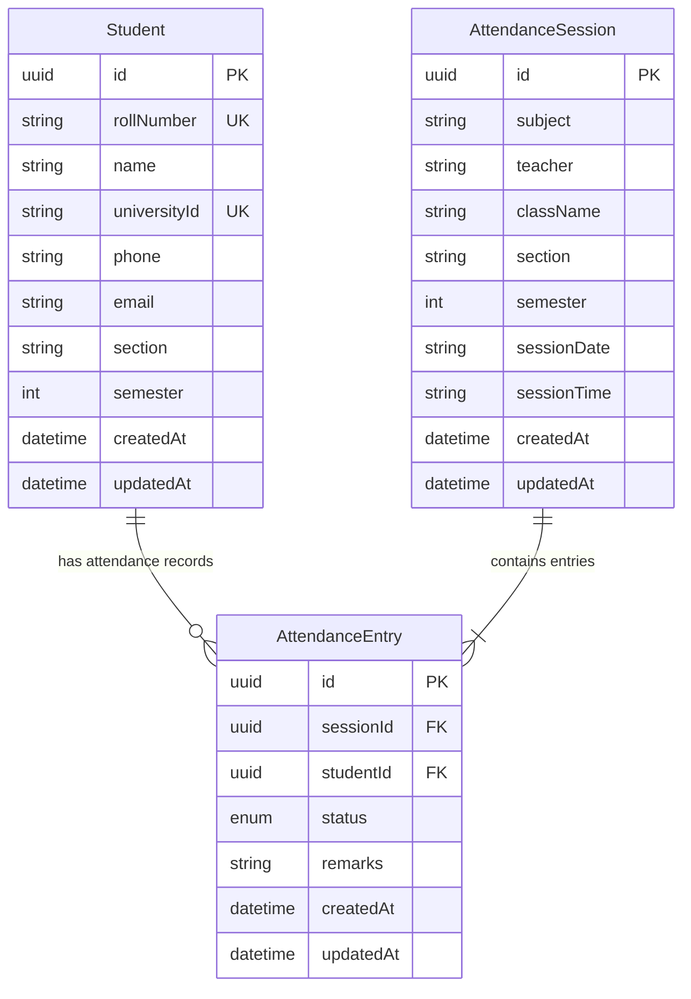

# CRMS Database Architecture & Prisma Schema

CRMS uses PostgreSQL with Prisma ORM. The relational model is fully normalized to guarantee data integrity, zero redundancy, and permanent session history retention.

---

## 🗄 Entity Relationship Model

---

## 📌 Database Principles & Rules

1. **UUID Primary Keys**: All entity IDs are generated as UUID v4 to support distributed syncing and offline sync capabilities.
2. **Session-Based Attendance Model**: Attendance is **NEVER** stored directly as a counter on the student record. Attendance exists exclusively inside immutable `AttendanceSession` and `AttendanceEntry` records.
3. **Cascading Safety**: Deleting an `AttendanceSession` cascades deletion to its associated `AttendanceEntry` rows. Deleting a `Student` soft-deletes or cascades entries cleanly depending on university audit policy.
4. **Performance Indexing**:
   - `students(rollNumber)` (Unique)
   - `students(name)` (Fuzzy search)
   - `students(section, semester)` (Filtering)
   - `attendance_sessions(sessionDate)` (History lookups)
   - `attendance_entries(sessionId, studentId)` (Unique pair constraint)
